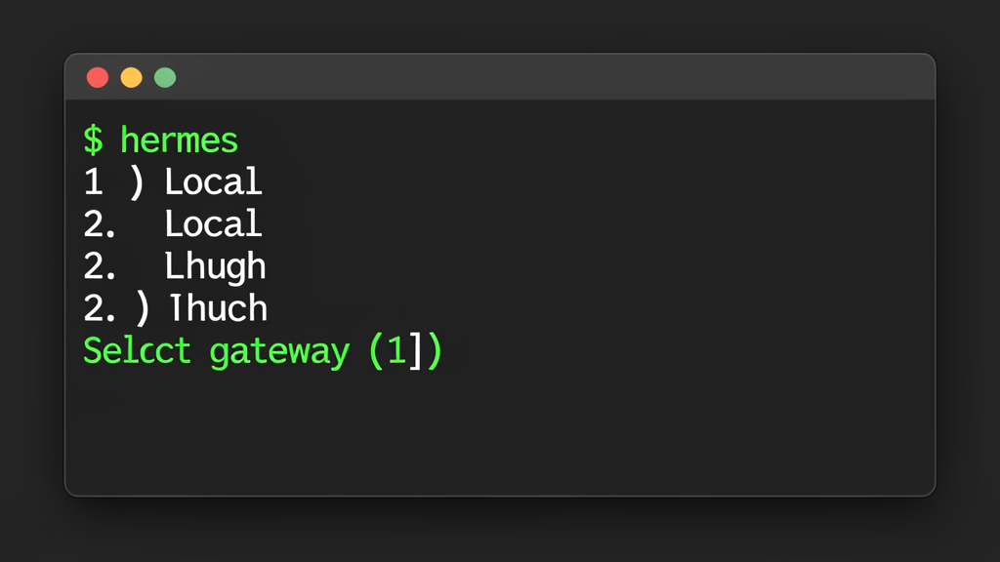

# Hermes Gateway Selector

Shell function + CLI tool for choosing between local and remote [Hermes Agent](https://hermes-agent.nousresearch.com) gateways from your terminal.



- Running `hermes` (no args) → interactive selector
- Running `hermes update`, `hermes setup`, etc. → passes through to the real binary
- No gateways configured? Runs `hermes` directly — no selector
- Works with **zsh** and **bash**

## Quick Start

```bash
# 1. Download the script
curl -fsSL https://raw.githubusercontent.com/tommulkins/hermes-gateway-selector/main/scripts/hermes-gateway -o ~/.local/bin/hermes-gateway
chmod +x ~/.local/bin/hermes-gateway

# 2. Install the shell wrapper (adds a source line to .zshrc or .bashrc, auto-detected)
hermes-gateway install

# 3. Add your remote gateways
hermes-gateway add "Work Laptop" "ws://192.168.1.100:9119/api/ws?token=YOUR_TOKEN"
hermes-gateway add "Home Server" "ws://10.0.0.5:9119/api/ws?token=YOUR_TOKEN"

# 4. Restart your shell, then just type `hermes`
source ~/.zshrc  # or ~/.bashrc
hermes
```

## Install via Hermes Agent

Already have Hermes running? Just ask your agent to install it for you:

> Install the hermes-gateway-selector skill from https://github.com/tommulkins/hermes-gateway-selector

The agent will clone the repo, copy the script to your PATH, run `hermes-gateway install`, and walk you through adding your first gateway.

## Setting Up a Remote Gateway

If you have Hermes Agent running on another machine (home server, work laptop, VPS), you can connect to it from your local terminal.

**On the remote machine** — tell the Hermes agent:

> I'd like to connect to you remotely from another machine. Can you set up the gateway and give me the WebSocket URL?

The agent will configure the gateway and return a URL like:

```
ws://192.168.1.100:9119/api/ws?token=your-api-token-here
```

> **Not on your local network, or need encryption?** Use `wss://` instead of `ws://` for TLS-encrypted connections. See [Security](#security) for details on setting up TLS and tunnels.

**On your local machine** — add it:

```bash
hermes-gateway add "Home Server" "ws://192.168.1.100:9119/api/ws?token=your-api-token-here"
```

Now `hermes` will show the selector with both Local and the remote gateway.

**Requirements on the remote machine:**
- Hermes Agent gateway must be running (`hermes gateway run` or installed as a service)
- The machine must be reachable on the gateway's port (default `9119`) from your local network
- The API token authenticates the connection — treat it like a password

For connecting over the internet, see [Security](#security) below.

## Commands

| Command | Description |
|---|---|
| `hermes-gateway` | Interactive selector (called by shell function) |
| `hermes-gateway list` | List configured gateways |
| `hermes-gateway add NAME URL` | Add a gateway |
| `hermes-gateway remove NAME` | Remove a gateway |
| `hermes-gateway run NAME [args]` | Open a TUI session directly on a named gateway, with optional hermes args |
| `hermes-gateway install` | Write shell function and add source line to rc file |
| `hermes-gateway uninstall` | Remove source line from rc file and delete function file |

## How It Works

1. `hermes-gateway install` writes the wrapper function to `~/.hermes/hermes-gateway.sh` and adds a single `source` line to your `.zshrc` or `.bashrc` (auto-detected based on `$SHELL`)
2. The function wraps the `hermes` binary — zero args triggers the selector, any args pass through untouched
3. When no gateways are configured, `hermes` launches directly with no selector prompt
4. Remote gateways launch via `HERMES_TUI_GATEWAY_URL` env var with `--tui`
5. Gateway definitions live in `~/.hermes/gateways.json`

The `install` command uses marker comments (`# >>> hermes-gateway-selector >>>` / `# <<< hermes-gateway-selector <<<`) in your rc file so `uninstall` cleanly removes only the source line without touching the rest of your config.

## Uninstall

```bash
hermes-gateway uninstall
# Removes the source line from .zshrc/.bashrc and deletes ~/.hermes/hermes-gateway.sh
rm ~/.local/bin/hermes-gateway
rm ~/.hermes/gateways.json
```

## Dependencies

- [`jq`](https://jqlang.github.io/jq/) (preferred) or `python3` (fallback) for JSON parsing
- The script runs in bash; the shell wrapper works in both zsh and bash

## Notes

- The selector only appears for bare `hermes` (zero arguments). Any arguments at all pass straight to the real `hermes` binary — `hermes update`, `hermes setup`, `hermes --tui` all work as expected.
- Remote gateways always launch with `--tui` since they're headless connections.
- Gateway tokens and hostnames are stored locally in `~/.hermes/gateways.json` — never committed or shared.

### `hermes-gateway run` Examples

```bash
# Open TUI on a named gateway
hermes-gateway run Hugh

# Continue the last session on a remote gateway
hermes-gateway run Hugh --continue

# Resume a specific session
hermes-gateway run Hugh --resume SESSION_ID

# Note: do not use -- as a separator — hermes argparse doesn't support it
# hermes-gateway run Hugh -- --continue  ← WRONG
# hermes-gateway run Hugh --continue     ← CORRECT
```

## Security

**Local network (home/office WiFi, LAN):** Works out of the box. The token is the only authentication — anyone on the same network with the URL has full agent access. This is fine for most home setups.

**Over the internet:** Works, but requires care:

- **Use `wss://` (TLS) not `ws://`** — plain `ws://` sends the token and all traffic in cleartext. Put a TLS-terminating reverse proxy (nginx, Caddy) in front of the gateway, or use a tunnel.
- **Use a VPN or tunnel instead of port forwarding** — exposing port 9119 directly to the internet is risky. Safer options:
  - [Tailscale](https://tailscale.com/) — zero-config WireGuard mesh, no ports exposed
  - [Cloudflare Tunnel](https://developers.cloudflare.com/cloudflare-one/connections/connect-apps/) — public URL with TLS, no port forwarding
  - [ngrok](https://ngrok.com/) — quick one-off tunnels for testing
- **The token is stored in plain text** in `~/.hermes/gateways.json`. Anyone with file access on your machine can read it.
- **Rotate tokens periodically** — if you suspect a token is compromised, ask the remote agent to regenerate it.
- **Don't paste the full URL (with token) into public channels** — it's equivalent to sharing a password.

## Shell Compatibility

The interactive `read` prompt uses `echo -n` + plain `read` for portability. This avoids two common pitfalls:

- `read -p "prompt" var` — **bash-only**, fails in zsh with "no coprocess"
- `read "var?prompt"` — **zsh-only**, fails in bash with "not a valid identifier"

The `echo -n` + `read` approach works identically in both shells.

## License

MIT
